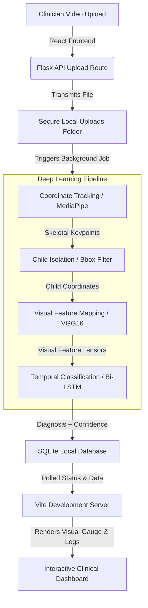

# ASD Detector: Clinical AI-Assisted Early Autism Screening Platform

An end-to-end medical AI screening platform designed to assist clinicians in the early identification of indicators for Autism Spectrum Disorder (ASD). The system leverages computer vision to extract scale-invariant skeletal keypoint sequences from child video recordings, processes them through a pre-trained convolutional encoder, and classifies sequential motor behaviors using a recurrent neural network (Bidirectional LSTM).

---

## 🚀 Key Features

### 💻 High-Fidelity React Frontend
- **Floating Glassmorphic Panel Design**: Cohesive, elevated card structures for the Sidebar and Top Navigation bar with consistent grid spacing.
- **Theme Persistence**: Light and Dark mode options persisting across page reloads via `localStorage`.
- **Integrated Onboarding Panel**: A step-by-step onboarding protocol screen showing guidelines for recording, uploading, and reviewing results.
- **Console Monitoring**: A simulated live command-line diagnostics terminal displaying backend execution steps.
- **Clinical Data Exports**: Standardized, downloadable clinical reports in both CSV and JSON formats.
- **Dynamic Visual Analytics**: Active confidence level gauges powered by HSL color-shifting SVGs and radial tracking circles.

### 🔌 Flask Backend REST API
- **Dynamic Job Polling**: Status endpoints (`/api/job/<job_id>`) supporting live pipeline stage transitions.
- **Secure File Upload**: API uploads supporting MP4, AVI, and MOV files with size-limit validations.
- **Technical Database Records**: Persistence of diagnostic predictions, confidence scores, execution metrics, and timestamp tracking.
- **Clinical Downloads**: Automatic creation and streaming of structured JSON datasets and downloadable CSV report attachments.

### 🧠 Deep Learning Neural Pipeline
- **Skeletal Coordinate Extraction**: High-accuracy joint localization tracking and rendering via custom MediaPipe pipelines.
- **Child Bounding Box Filter**: Automatic isolation of child coordinate streams, removing parent or examiner joints to prevent model bias.
- **VGG16 Visual Feature Encoder**: Frame sequences mapped to 4096-dimensional visual feature vectors using a frozen ImageNet-trained VGG16 base.
- **Bidirectional LSTM Classifier**: Recurrent sequence evaluation across forward and backward temporal paths to capture motor behavior indicators.

---

## 📐 System Architecture



---

## 🛠️ Installation & Local Setup

### Prerequisites
- Python 3.8 to 3.11
- Node.js (v18 or higher) & npm

### 1. Flask Backend Setup
1. Navigate to the backend directory:
   ```bash
   cd backend
   ```
2. Create and activate a Python virtual environment:
   ```bash
   # Windows
   python -m venv venv
   .\venv\Scripts\activate
   
   # macOS/Linux
   python3 -m venv venv
   source venv/bin/activate
   ```
3. Install the required Python dependencies:
   ```bash
   pip install -r requirements.txt
   ```
4. Initialize the local database:
   ```bash
   python init_db.py
   ```
5. Start the Flask development server:
   ```bash
   flask run --port=5000
   ```
   *The backend API will be listening at `http://127.0.0.1:5000`.*

### 2. React Frontend Setup
1. Navigate to the frontend directory:
   ```bash
   cd ../frontend
   ```
2. Install the Node package dependencies:
   ```bash
   npm install
   ```
3. Start the Vite development server:
   ```bash
   npm run dev
   ```
4. Open your browser and navigate to `http://localhost:5173`.
   *The development server proxies API calls (under `/api`, `/upload`, and `/reports`) automatically to the backend on port 5000.*

---

## 📊 Pipeline Command Reference

If you are a researcher or developer running standalone experiments, you can execute the deep learning scripts directly:

### 1. Generate Labeled Subset Metadata
Prepares a balanced metadata index (e.g., 2 subjects per group, 30 clips per subject):
```bash
python scripts/create_balanced_subset_metadata.py --subjects-per-group 2 --max-videos-per-subject 30 --output outputs/vgg16_lstm/subset_metadata.csv
```

### 2. Extract Child-Only VGG16 Features
Crops child tracking boundaries and extracts dense visual features from coordinate frames:
```bash
python scripts/extract_child_vgg16_features.py --metadata outputs/vgg16_lstm/subset_metadata.csv --child-seq-dir outputs/child_sequences --out-dir outputs/vgg16_lstm/features --max-frames 30 --batch-size 32 --force
```

### 3. Train the Recurrent Neural Network
Trains the Bidirectional LSTM sequence classifier on the visual feature tensors:
```bash
python scripts/train_child_vgg16_lstm.py --data-dir outputs/vgg16_lstm/features --epochs 30 --batch-size 16 --hidden-dim 128 --dropout 0.3
```

---

## 📈 Model Performance & Metrics

The neural classifier is trained on balanced clips across diagnosed Autism Spectrum Disorder (ASD) and Typical Development (TD) subjects.

### Latest Smoke-Test Evaluation Results
- **Overall Accuracy**: **78.33%**
- **Precision**: **82.69%**
- **Recall (Sensitivity)**: **71.67%**
- **F1-Score**: **76.79%**

*The evaluation report metadata is recorded inside `outputs/vgg16_lstm/child_vgg16_lstm_report.json`.*

---

## 🔒 HIPAA & Clinical Compliance

The ASD Detector platform is architected with strict clinical security and data privacy safeguards:
- **De-identified Skeletal Data**: The pipeline processes only 2D joint coordinate streams. Video frames are analyzed locally, and facial landmarks are converted to mathematical nodes, eliminating visual identifiers.
- **HIPAA-Ready Architecture**: Supports complete local offline deployment. Patient databases are stored locally in SQLite (`instance/`), preventing any external data leakage.
- **Audit Logs & Tracking**: Every screening run registers a unique cryptographic reference key (`Job ID`), complete with timestamp logging and full pipeline diagnostics.
