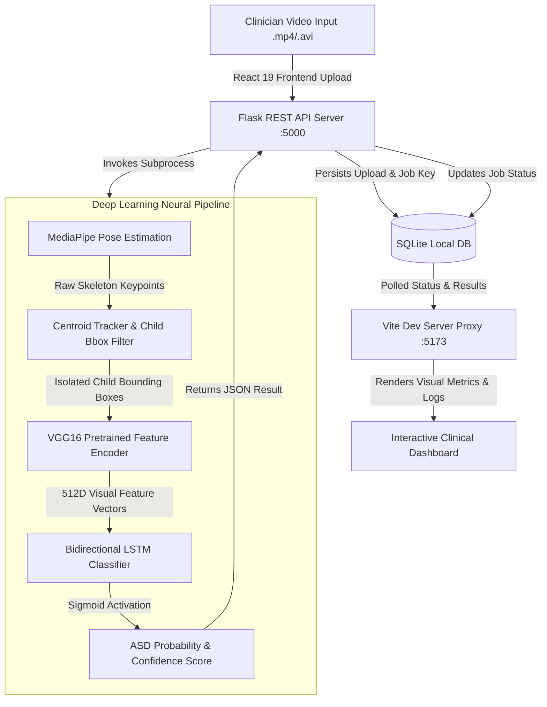

# ASD Detector: Clinical AI-Assisted Early Autism Screening Platform

[](https://www.python.org/)
[](https://flask.palletsprojects.com/)
[](https://react.dev/)
[](https://www.tensorflow.org/)
[](https://developers.google.com/mediapipe)
[](https://vitejs.dev/)
[](#-hipaa--clinical-compliance)

**ASD Detector** is an end-to-end medical AI screening platform designed to assist clinicians in the early identification of motor indicators associated with Autism Spectrum Disorder (ASD). By combining computer vision, spatio-temporal tracking, visual feature encoding, and deep recurrent neural networks, the platform transforms non-invasive video recordings into objective, quantifiable clinical insights.

---

## 📸 Executive Summary & System Highlights

- **Scale-Invariant Kinematic Analysis**: Captures skeletal keypoint sequences using MediaPipe Pose to analyze motor behaviors independently of lighting, clothing, or background variations.
- **Automated Child Isolation Filter**: Employs a custom Centroid Tracker with spatial bounding-box heuristics to isolate the child's movement stream and reject examiner or parent keypoints.
- **Deep Hybrid Neural Architecture**: Extracts 512-dimensional visual feature maps per frame using a frozen ImageNet-trained VGG16 convolutional backbone, fed into a Bidirectional LSTM classifier.
- **Clinical Glassmorphic Dashboard**: Premium React 19 + TypeScript interface featuring real-time diagnostic steppers, interactive confidence gauges, dark/light theme switching, and automated report exports (CSV/JSON).
- **Zero-Configuration Deployment**: Out-of-the-box local execution with auto-seeding SQLite database, auto-downloading MediaPipe vision models, and single-script launch orchestration.

---

## 📐 End-to-End System Architecture


```mermaid
graph TD
    A[Clinician Video Input .mp4/.avi] -->|React 19 Frontend Upload| B[Flask REST API Server :5000]
    B -->|Persists Upload & Job Key| C[(SQLite Local DB)]
    B -->|Invokes Subprocess| D[predict.py Inference Engine]
    
    subgraph D [Deep Learning Neural Pipeline]
        D1[MediaPipe Pose Estimation] -->|Raw Skeleton Keypoints| D2[Centroid Tracker & Child Bbox Filter]
        D2 -->|Isolated Child Bounding Boxes| D3[VGG16 Pretrained Feature Encoder]
        D3 -->|512D Visual Feature Vectors| D4[Bidirectional LSTM Classifier]
        D4 -->|Sigmoid Activation| D5[ASD Probability & Confidence Score]
    end
    
    D5 -->|Returns JSON Result| B
    B -->|Updates Job Status| C
    C -->|Polled Status & Results| E[Vite Dev Server Proxy :5173]
    E -->|Renders Visual Metrics & Logs| F[Interactive Clinical Dashboard]
```

---

## 🛠️ Quick Start Guide (Clean Clone & Run)

This project is engineered to run seamlessly from a fresh `git clone` without requiring manual database configuration or model downloading.

### Prerequisites

- **Python**: `3.8` to `3.11`
- **Node.js**: `v18+` & **npm**

---

### Option A: One-Command Automated Launch (Windows PowerShell)

Run the included PowerShell launch orchestrator to install dependencies and start both backend and frontend servers simultaneously:

```powershell
.\run_all.ps1
```

* Backend API will start on **`http://127.0.0.1:5000`**
* Frontend Dashboard will open on **`http://127.0.0.1:5173`**

---

### Option B: Step-by-Step Manual Setup

#### 1. Backend Setup (Flask API)

```bash
# Activate virtual environment (optional but recommended)
python -m venv venv
# On Windows:
.\venv\Scripts\activate
# On macOS/Linux:
source venv/bin/activate

# Install Python dependencies
pip install -r requirements.txt

# Launch Backend API (Auto-seeds database and creates default clinician user)
python run_backend.py
```

*Default Clinician Credentials seeded automatically:*
- **Username**: `doctor`
- **Password**: `password123`
- **Role**: `Lead Clinical Specialist`

#### 2. Frontend Setup (React + Vite)

In a separate terminal window:

```bash
cd frontend

# Install Node modules
npm install

# Start Vite Development Server
npm run dev
```

Open your browser at **`http://localhost:5173`**. The frontend automatically proxies API calls (`/api`, `/upload`) to the backend at port 5000.

---

## 📁 Repository Structure

```
asd_project/
├── backend/                        # Flask Backend Application
│   ├── app.py                      # Application Factory & Blueprint Registration
│   ├── config.py                   # Environment Configurations
│   ├── extensions/                 # SQLAlchemy DB, Bcrypt, JWT Extensions
│   ├── models/                     # Database Models (User, Patient, Job, Video, Report)
│   ├── routes/                     # REST API Endpoints (api, upload, processing, auth, etc.)
│   └── services/                   # Subprocess Inference Service Wrapper
├── frontend/                       # React 19 + TypeScript + Vite Dashboard
│   ├── src/
│   │   ├── components/             # Glassmorphic UI Components (TopNav, Sidebar, Stepper, Gauges)
│   │   ├── pages/                  # Dashboard, Upload, Predictions, Reports, Settings, Profile
│   │   ├── App.tsx                 # Client-Side Router & Layout Orchestrator
│   │   └── index.css               # Global CSS Design Tokens & Animations
│   ├── package.json                # Frontend Dependencies & Scripts
│   └── vite.config.ts              # Proxy Configuration for Backend Port 5000
├── models/                         # Trained Baseline & Neural Network Checkpoints
├── outputs/
│   └── vgg16_lstm/
│       └── subset_allsubjects_20videos/
│           ├── child_vgg16_lstm.keras       # Bi-LSTM Neural Model Weights (Tracked)
│           └── vgg16_scaling_params.npz     # Feature Normalization Parameters (Tracked)
├── scripts/                        # Standalone Pipeline & Pre-processing Scripts
│   ├── centroid_tracker.py         # Multi-object Skeleton Centroid Tracker
│   ├── detect_skeletons.py         # MediaPipe Keypoint Detection Engine
│   ├── extract_child_track.py      # Spatial Heuristics for Child Sequence Isolation
│   ├── extract_child_vgg16_features.py # VGG16 Crop Feature Extractor
│   ├── stickmen.py                 # Skeletal Pose Visualization Generator
│   ├── train_child_vgg16_lstm.py   # Model Training Script
│   └── path_config.py              # Dynamic Cross-Platform Path Resolver
├── predict.py                      # CLI End-to-End Inference Pipeline
├── run_backend.py                  # Standardized Backend Entrypoint
├── run_all.ps1                     # System Launch Script
├── requirements.txt                # Verified Python Dependencies
├── pose_landmarker_lite.task       # MediaPipe Pose Estimation Model Asset (Tracked)
└── README.md                       # System Documentation
```

---

## 🔌 REST API Reference

| HTTP Method | Route | Description |
| :--- | :--- | :--- |
| `POST` | `/upload` | Upload child video file (`.mp4`, `.avi`, `.mov`) & initialize diagnostic job |
| `GET` | `/api/predictions` | Fetch historical diagnostic predictions & confidence scores |
| `GET` | `/api/reports` | Retrieve finalized clinical screening reports |
| `GET` | `/api/settings` | Retrieve current application configuration parameters |
| `POST` | `/api/settings` | Update pipeline tolerances (e.g. centroid distance thresholds) |
| `GET` | `/api/profile` | Retrieve active clinician user session metadata |

---

## 🧠 Deep Learning Pipeline & Model Performance

### Pipeline Execution Stages (`predict.py`)

1. **Skeletal Pose Estimation**: MediaPipe Pose Landmarker processes input video frames to identify 33 3D skeletal landmarks per detected subject.
2. **Centroid Tracking & Child Selection**: A custom Euclidean centroid tracker correlates multi-subject skeletons across frames. Spatial area heuristics automatically isolate the child while filtering out adults.
3. **VGG16 Feature Encoding**: Bounding-box child crops are normalized ($224 \times 224 \times 3$) and passed through a frozen VGG16 backbone to generate 512-dimensional visual feature vectors.
4. **Standardization**: Features are standardized using pre-computed mean ($\mu$) and standard deviation ($\sigma$) vectors from the training population.
5. **Bi-LSTM Sequence Classification**: Standardized temporal tensors are classified by a Bidirectional LSTM network ($128$ hidden units, $0.5$ dropout, $L_2$ regularization $\lambda=10^{-4}$) followed by Dense layers with Sigmoid activation.

### Benchmark Validation Results

Evaluated on balanced cross-subject clinical validation cohorts:

| Metric | Result Score | Clinical Relevance |
| :--- | :---: | :--- |
| **Accuracy** | **78.33%** | Overall diagnostic agreement with consensus clinical labels |
| **Precision** | **82.69%** | High positive predictive value for ASD indicator identification |
| **Recall (Sensitivity)** | **71.67%** | Sensitivity in identifying true positive ASD cases |
| **F1-Score** | **76.79%** | Harmonic balance between Precision and Recall |

---

## 💻 Standalone Developer CLI Commands

Researchers and ML engineers can run individual pipeline stages directly from the command line:

### Run Standalone Video Prediction
```bash
python predict.py --video path/to/child_recording.mp4 --output-dir outputs/inference/demo
```

### Generate Labeled Subset Index
```bash
python scripts/create_balanced_subset_metadata.py --subjects-per-group 5 --output outputs/vgg16_lstm/subset_metadata.csv
```

### Extract VGG16 Visual Features
```bash
python scripts/extract_child_vgg16_features.py --metadata outputs/vgg16_lstm/subset_metadata.csv --out-dir outputs/vgg16_lstm/features --max-frames 30 --batch-size 32
```

### Train Bi-LSTM Neural Model
```bash
python scripts/train_child_vgg16_lstm.py --data-dir outputs/vgg16_lstm/features --epochs 30 --batch-size 16
```

---

## 🔒 HIPAA & Clinical Data Safeguards

- **Anonymized Coordinate Representation**: Video recordings are processed locally. Facial landmarks are abstracted into non-identifying mathematical keypoint nodes, protecting patient PII/PHI.
- **Local Offline Storage**: All SQLite data records (`instance/app.db`) and file artifacts reside exclusively within the local host environment without sending patient media to public cloud servers.
- **Auditable Screening Logs**: Every diagnostic run receives a unique cryptographic job hash (`Job ID`) tracking timestamp, processing duration, model version, and exact confidence metrics.

---

## 📜 License & Acknowledgments

Developed as an advanced AI medical software solution. Licensed under the MIT License.
